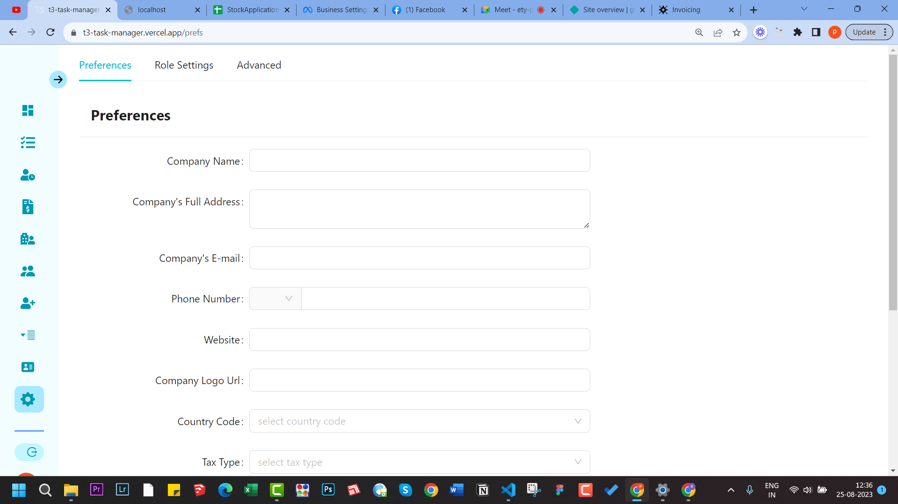
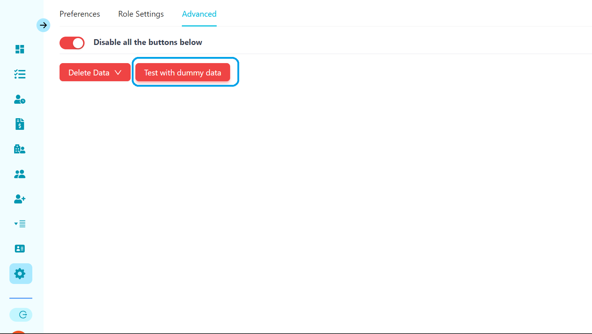
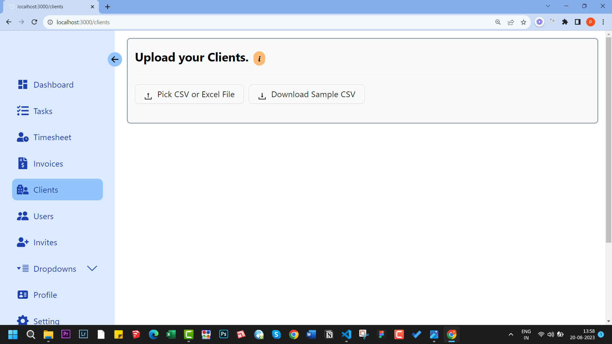

import Comments from "../../../components/Utterances.astro";

When you first open the application you will find that it's pre populated with dummy data.
You can try it out or you can delete it. Then you can start it with blank.

First step would be to save you application preferences.
Go to settings.
There you will find three tabs - Preferences, Role Setting & advanced.

You can also import you previous clients into this application.
Read [this guide](/guides/) to see how it's done.

## Save Application Preferences

- When you start with this application, you should first savae your application preferences.
- It's like you company's profile, tax settings etc.

## Try it out with dummy data

- Navigate to Setting > Advanced.
- Click on the switch to enable beow buttons.
- Click on Test with dummy data.
- Proceed with the confirmation prompt.
  

## Delete App Data

- Navigate to Setting > Advanced.
- Click on the switch that says Enable below buttons.
- You will be presented with two buttons - `Delete all` & `Delete all except users data`.

### Delete app data except user data and app preferences

- Navigate to Setting > Advanced.
- Click on the switch to enable beow buttons.
- Click on Delete and then choose Delete All data except user's data.
- Proceed with the confirmation prompt

## Watch this video guide

  <iframe
    width="730"
    height="400"
    src="https://www.youtube.com/embed/HuGzHHk8B_M"
    title="YouTube video player"
    frameborder="0"
    allow=""
    allowfullscreen
  ></iframe>

### Delete entire application data

- Navigate to Setting > Advanced
- Click on Delete and then choose Delete All .
- Proceed with the confirmation prompt
  

## Import your clients

- Navigate to Setting > Advanced
- Click on Pick CSV or excel file.
  :::note
  You should first download sample CSV file to know the appropriate column fields. You can download it and then add your clients to it keeping the column names same and then upload it.
  :::
  

- Watch this video

  <iframe
    width="560"
    height="315"
    src="https://www.youtube.com/embed/nzhbdm83hrk?si=plLXueui_T2TFY3F"
    title="YouTube video player"
    frameborder="0"
    allow=""
    allowfullscreen
  ></iframe>

  <Comments />

