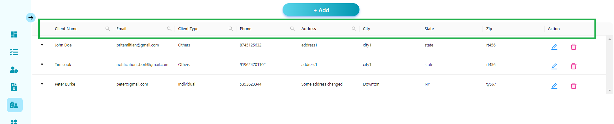
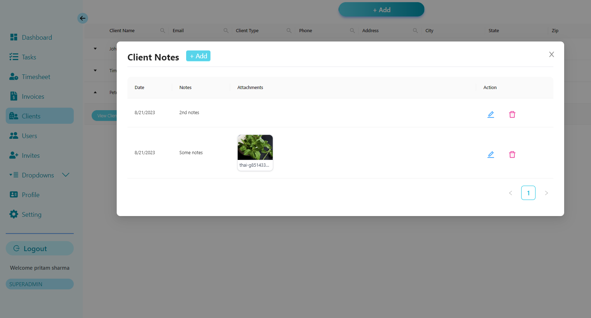
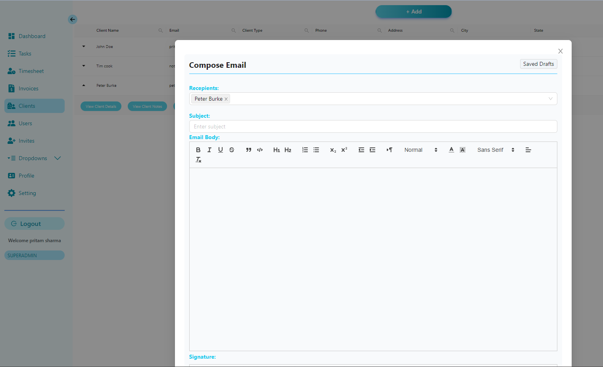

import Comments from "../../../components/Utterances.astro";

## All the fields associated with a client

## Adding, editing and deleting clients

- Navigate to Clients page. Then click on Add Button.
- For editing and deleting client simply click on edit/delete icon.
- You cannot edit a client linked to another tasks. Doing so will throw error.
  

    <iframe
      width="560"
      height="315"
      src="https://www.youtube.com/embed/ODX65Y12W94"
      title="YouTube video player"
      frameborder="0"
      allow="accelerometer; autoplay; clipboard-write; encrypted-media; gyroscope; picture-in-picture; web-share"
      allowfullscreen
    ></iframe>
  

## Action buttons associated with each task

- View Client Details
- Client Notes
- Related Task
- Compose Mail
- Conversation
- Whatsapp

### View Client Details

### Adding client Notes

### Editing Client Notes

### Adding/Editing Client Tasks

### Composing and sending emails

### WhatsApp your Client

You can Whatsapp your client directly from the client page. You can also send
them a message if they are _not in your contact list_.

  <iframe
    width="560"
    height="315"
    src="https://www.youtube.com/embed/LKvWFucd2Ug"
    title="YouTube video player"
    frameborder="0"
    allow="accelerometer; autoplay; clipboard-write; encrypted-media; gyroscope; picture-in-picture; web-share"
    allowfullscreen
  ></iframe>

## Filters
You can very easily search and filter your clients by clicking on the magnifying glass icon on the displayed table header.

  <Comments />

