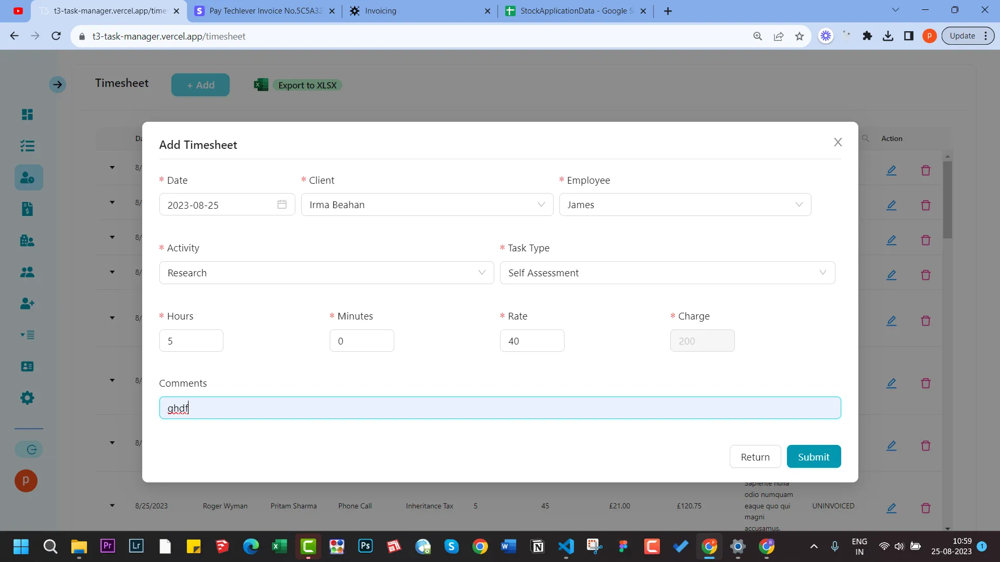
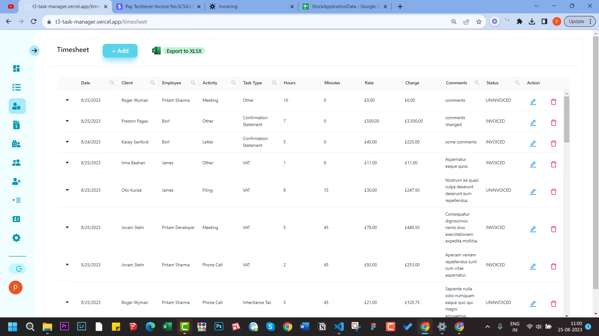

import Comments from "../../../components/Utterances.astro";

## Adding Timesheet

- Navigate to Tasks
- Select any completed task
- Now click on Add Timesheet
  :::note
  You can only add a timesheet to the completed task. You can mark any completed by clicking on Mark Complete or Mark Complete Recreate. The latter option will also recreate the task based on the set periodicity.
  For more details [view this guide](/guides/3-tasks)
  :::
- You can view the added timesheet entry by first selecting the task and then clicking on View Timesheet.
  :::note
  View Timesheet button will only appear if there is any associated timesheet entry.
  :::

## A few screenshots related to Timsheets

  <Comments />

