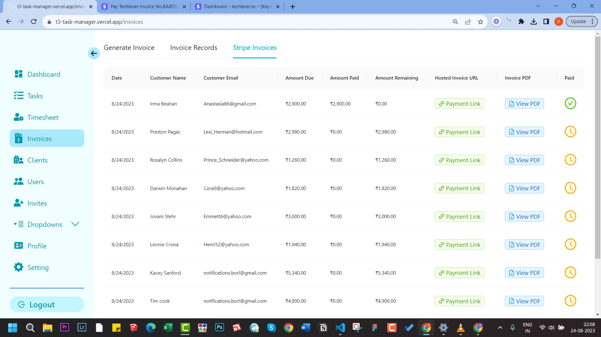
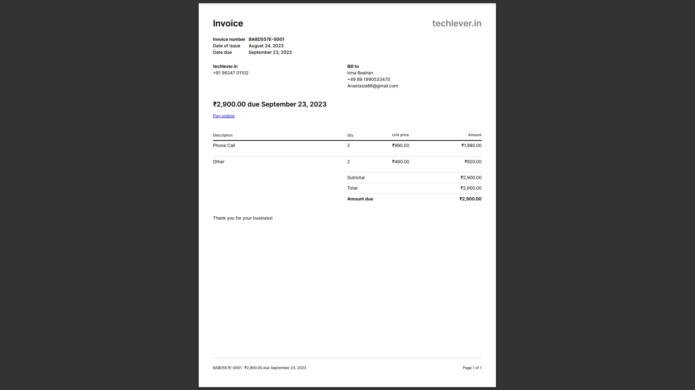
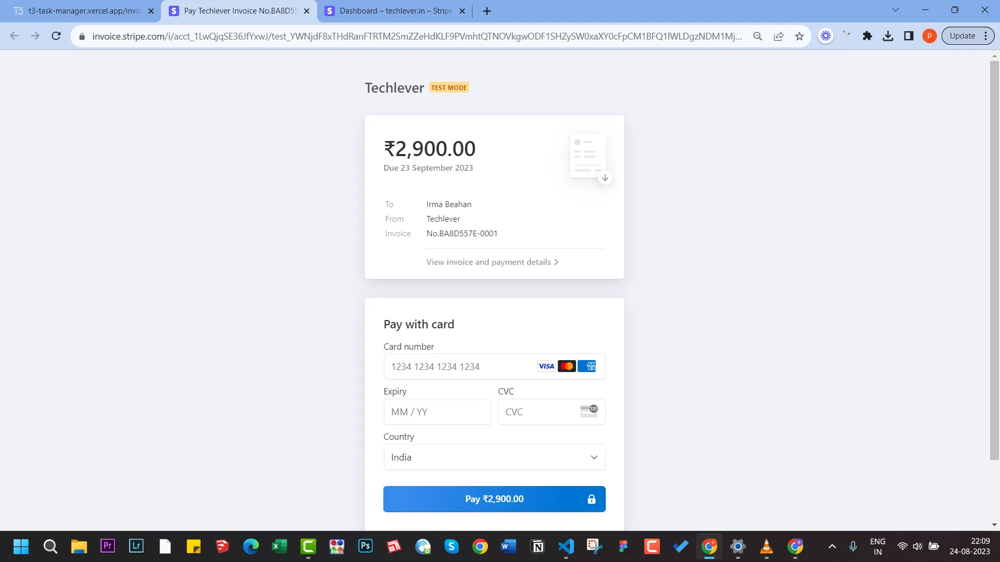

import Comments from "../../../components/Utterances.astro";

Before you move on to the Invoice page make sure you have created a timesheet entry for the completed task.
[See this guide](/guides/4-creating-timesheet-entry) to know how to create a timesheet entry.

### Fetching tasks for invoicing

- Navigate to Invoices > Generate Invoice
- Select the Client against whom you want to raise an invoice
- Click on Generate Stripe Invoice
  
  The above action will do the following:
- It will first create a Stripe Customer if it does not exist.
- Then it will check if there are any outstanding tasks against the selected client.
- If there are outstanding tasks then it will generate Stripe Invoice for that.
- 
  :::note
  If generating Stripe customer fails due to Stripe's server downtime or any other reason then the invoice generation will fail. In this event, you can simply refresh it and try again
  :::

### View Stripe Invoice PDF and Paylink

You can view the generated Invoice PDF and Payment page by clicking on the respective buttons on the Stripe Invoice tab.
:::note
When you generate a Stripe Invoice, it will also send an email to the client with the attached invoice pdf and payment page.
:::

- Invoice PDF
  
- Payment page
  

## Watch video guide

  <iframe
    width="730"
    height="400"
    src="https://www.youtube.com/embed/l47mSnE9-eY?si=7edt3Ge8N2oR3qff"
    title="YouTube video player"
    frameborder="0"
    allow=""
    allowfullscreen
  ></iframe>

  <Comments />

