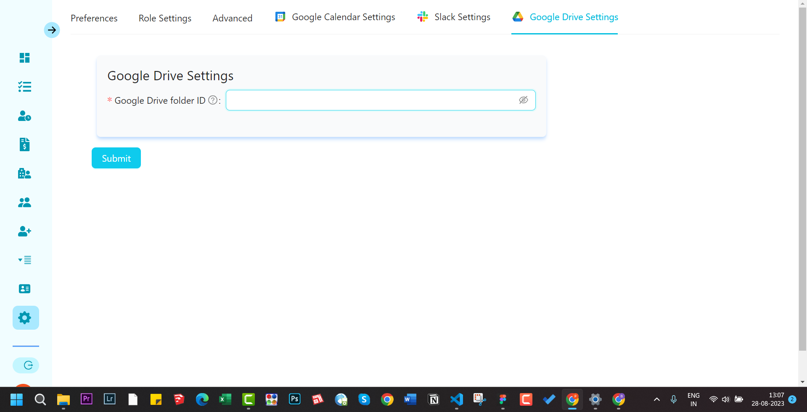

import CalendarIcon from "../../../components/icons/calendar.astro";
import SlackIcon from "../../../components/icons/slack.astro";
import DriveIcon from "../../../components/icons/drive.astro";
import Comments from "../../../components/Utterances.astro";

## Following integrations are supported

### Slack

<SlackIcon />
 You
can send your created clients, task, client notes or task notes to different slack
channel. You will have to choose from different slack channel that you have created
and map it to corresponding form submission.

:::note
You can only send messages to public channel. By public channel it means that anyone in your workspace can message to this channel.
:::

### Google Calendar

<CalendarIcon />
To use this feature, you need to first authorize the application to access your google
calendar. 

:::note
This authorization is different from the application authorization. This
is Google authorization. You need to be signed in to your google account. Once authorized
you will be presented with a list of your google calendars.
:::

After authorization, you will be presented with a list of your google calendars. You
can choose from the list of calendars and make it your default calendar where your task will be added.

You need to copy embed code from the calendar settings and paste it in the `Embed code for calendar` field.

#### Watch this video guide

  <iframe
    width="730"
    height="400"
    src="https://www.youtube.com/embed/paHSv4n2_sI"
    title="YouTube video player"
    frameborder="0"
    allow=""
    allowfullscreen
  ></iframe>

### Google Drive

<DriveIcon />

:::note
The Google Drive folder where you want to store your files related to client
notes and task notes need to be shared with the service account email address.
:::

  <Comments />

