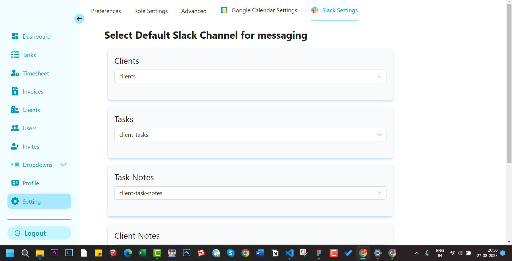
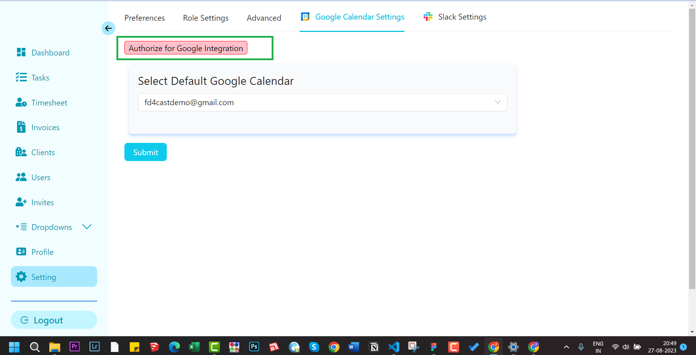

import CalendarIcon from "../../../components/icons/calendar.astro";
import SlackIcon from "../../../components/icons/slack.astro";

## Following integrations are supported

### Slack

<SlackIcon />
 You
can send your created clients, task, client notes or task notes to different slack
channel. You will have to choose from different slack channel that you have created
and map it to corresponding form submission.

:::note
You can only send messages to public channel. By public channel it means that anyone in your workspace can message to this channel.
:::

### Google Calendar

<CalendarIcon />

:::note This authorization is different from the application authorization. This
is Google authorization. You need to be signed in to your google account. Once authorized
you will be presented with a list of your google calendars. :::
